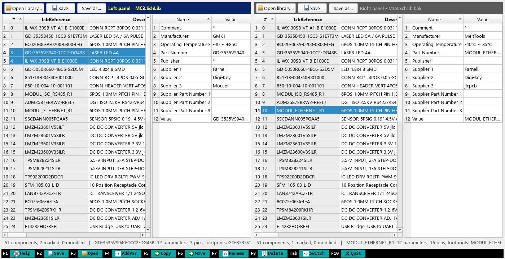
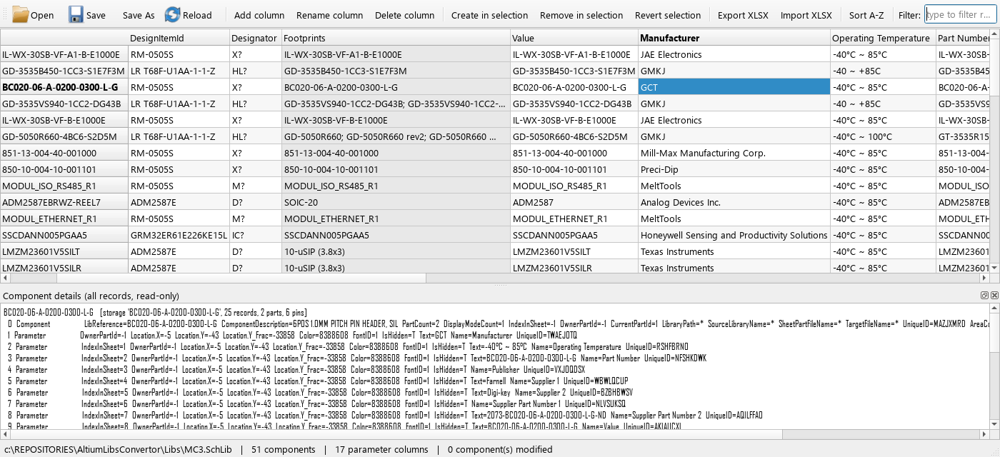

# altium-schlib-tools

Browse and edit Altium Designer schematic symbol libraries (`.SchLib`) without Altium,
and copy or move components between two libraries.



## SchLib Commander

`SchLibCommander.bat [left.SchLib] [right.SchLib]`

Two identical panels, Norton Commander style. Only one panel is active (Tab or a mouse click switches).
In each panel the left table lists the components of the library, the right table the parameters of the
current component. Cells are edited in place (Enter or double-click); click a column header to sort.

| Key | Button | Action |
|---|---|---|
| F1 | Help | key reference |
| F2 | Save | save the active library (a `.bak` copy is written next to it) |
| F3 | Open | open a library in the active panel |
| F4 | AddPar | add a parameter to the current component |
| F5 | Copy | copy marked components (or parameters) to the other panel |
| F6 | Move | move marked components to the other panel |
| F7 | Rename | rename the current component (or parameter) |
| F8 / Del | Delete | delete marked components (or parameters) |
| Insert | | mark / unmark a component, Ctrl+click and Shift+click also work |
| F10 | Quit | quit |

Every key has a button with an icon in the bottom bar, so it works on keyboards without function keys.
Yellow cells are changed since the library was loaded; bold names are modified components.

## Table editor and command line

`python src\schlib_param_editor.py lib.SchLib` shows one library as a grid (rows = components,
columns = parameters) with Excel import/export. `python src\schlib_params.py dump|diff|apply ...`
does the same round trip through `.xlsx` / `.csv` from the command line.



## Install

Windows only: writing uses the Windows Structured Storage API (`pywin32`), the same code path Altium reads with.

1. Install Python 3.10+ from python.org and tick *Add python.exe to PATH*.
2. Run `install.bat` (installs `olefile`, `pywin32`, `openpyxl`, `PyQt5`).
3. Start `SchLibCommander.bat`.

## Notes

* Only the streams you change are rewritten; the rest of the file stays byte-identical.
* Libraries written by these tools have not yet been verified in Altium Designer by the author.
  Work on copies until you have checked the result on your own installation.
* The `.SchLib` structure (record framing, positional indices, pin layout) is described in the
  docstring at the top of `src/altium_schlib.py`.

## Using the parser from Python

```python
import sys; sys.path.insert(0, "src")
import altium_schlib as asl

lib = asl.SchLib.load("MC3.SchLib")
comp = lib.component("TPS62933DRLR")
print(comp.description, comp.designator, comp.footprints)
for p in comp.params:
    print(p.name, "=", p.value)
comp.set_param("Supplier 3", "jlcpcb")   # created when missing
lib.save("MC3_edited.SchLib")            # lib.save() overwrites and keeps a .bak
```
